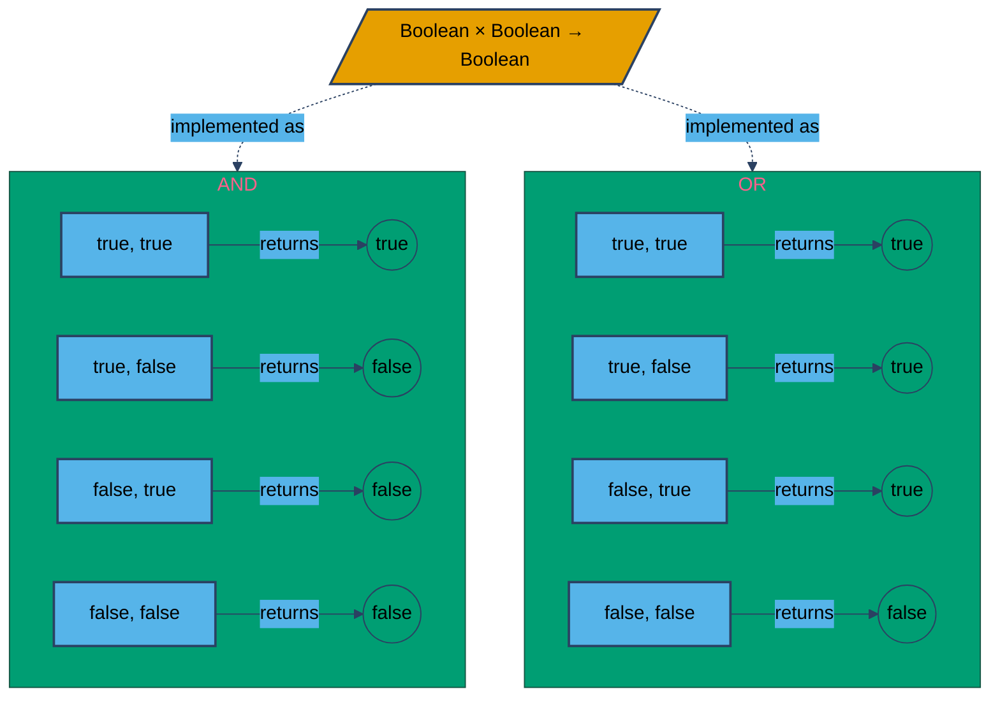
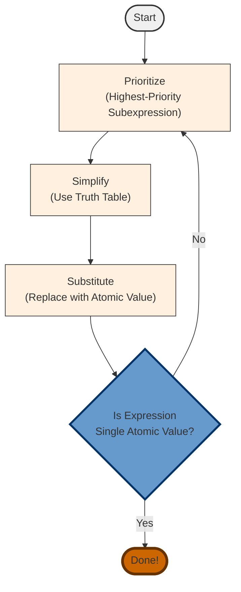
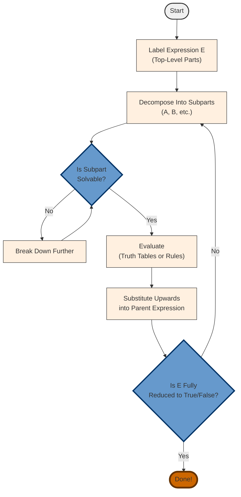

# Level 0.1: Booleans

In programming we must deal with many different types of data both for representing complex models, computing across equations, or even to provide an efficient user interface. However from a computer's perspective, this will often be broken down into simpler problems. And in this case we are here to discuss the simplest type we will be discussing in this course: *booleans*.
In this chapter we will:
1. *Define* booleans once again,
2. Formally describe the *behavior* of boolean operators,
3. Run through the process of *evaluating* boolean expressions,
4. Formally define and use *truth tables* to compute boolean expressions.

%% What if we introduce variables here in that we use variables, not in code but in solving these problems. We acknowledge in truth tables that when we talk about inputs to operators, we need some placeholder to define their behavior, this cleanly transitions into using variables... which we can formally define here or later, whichever makes more sense. %%

%% NOTE: we should introduce examples as:
Let's define x to be the boolean expression ..., 
x is complicated, and while we could try solving this in this form here, let's break it apart a bit instead.
we can break x down into two parts,
let's define y to be the left part...
and z to be the right part...
...
%%

---
## Defining Our Terms

Before we can start solving all of these boolean expressions, we need first define a boolean

>[!abstract] Booleans
>>[!Definition]
>> A *Boolean* represents the logical value *true* or *false*. 
>
> Often shown as 1/0 (on/off) or T/F in circuits and other systems. C# uses *true*/*false*.

In programming, we consider Booleans to be the cornerstone of decision making and code execution. Most things require us to make a decision. Our job as programmers will often boil down to taking abstract problems and representing them as a sequence of boolean expressions.

Any yes or no question is simply a boolean expression. When you search for something online, you are using words that the search engine will use to create a complex boolean expression to filter the results. In Level 2: Control Structures, we will cover how we use conditionals to cause different behaviors in our code as well. But first, let's worry about the operators that will let us build interesting boolean expressions.

>[!abstract] Boolean Operators
>>[!Definition] NOT
>> $NOT: Bool \rightarrow Bool$ is the logical negation operator. It flips *true* to *false*, and vice versa. Represented by `!` in C#.
>
>>[!Definition] AND
>> $AND: (Bool,Bool)\rightarrow Bool$ returns true when **both** operands are true. Otherwise it returns false. Represented by `&&` in C#.
>
>
>>[!Definition] OR
>>$OR: (Bool,Bool) \rightarrow Bool$ returns true when **either** operand is true. Otherwise, it returns false. Represented by `||` in C#.
>
> Notice that NOT takes only one operand, while the others take two. We often refer to single input operators as *unary* operators, while for two inputs we have *binary* operators.
>
> These three operators are all you need to represent any boolean problem. here's how it looks in code:
>> [!example] 
>> ```csharp
>>  !true // evaluates to false
>>  true && true // evaluates to true
>>  false || !false && true || false // evaluates to true
>> ```
>

You may notice in our definitions: both AND and OR share the same type signature! This may feel unintuitive, but it's important to note that a type signature exists to tell you and  the computer what kind of thing(s) go in, and what kind of thing comes out. They say nothing about how specific values are decided. That's why we describe *both* the typing of an operator, and separately, its behavior. To illustrate this, examine the figure below:



Notice in this figure, we cover every possible combination of inputs. This is standard when we define behavior in code: we want to cover all possible values to avoid errors or undefined behavior.

There's actually a formal notation for fully defining the behavior of different boolean expressions: the *Truth Table*. The goal of a truth table is: for every possible combination of inputs, what would the output be? Let's start with an example for NOT:


|   X   |  NOT X  |
| :---: | :-----: |
| true  | (blank) |
| false | (blank) |
Each column will represent a combination of values. The column(s) *after* our inputs will be filled in after, representing the output if we use the combination of inputs in the same row. Again: each row represents a combination of inputs, and the corresponding output received by using those inputs.

So after we've filled out the possible values for our input X, we can compute the output for each row:

|   X   |      NOT X       |
| :---: | :--------------: |
| true  | NOT true = false |
| false | NOT false = true |

Let's do this again but for one with multiple inputs: AND

| A     | B     | A AND B |
| ----- | ----- | ------- |
| false | false |         |
| false | true  |         |
| true  | false |         |
| true  | true  |         |
Remember, out input variables are fixed. We just fill out every possible combination in order. Once this is done, we can figure out what the outputs for each row (combination of inputs) are. Here it is broken down a little more:

| A     | B     | A AND B         |
| ----- | ----- | --------------- |
| false | false | false AND false |
| false | true  | false AND true  |
| true  | false | true AND false  |
| true  | true  | true AND true   |

Which then simplifies to:

| A     | B     | A AND B |
| ----- | ----- | ------- |
| false | false | false   |
| false | true  | false   |
| true  | false | false   |
| true  | true  | true    |

>[!important] Exercise
>Fill out the truth table for OR:
>
>| A     | B     | A OR B |
>| ----- | ----- | ------- |
>|___    |___    |___       |
>|   ___  |    ___  |  ___     |
>|   ___   |  ___   |  ___     |
>|   ___   |  ___    |    ___    |

---
## Evaluating Expressions

Now that we have precise definitions for how our operations work, let's cover one more important piece before we dive into solving problems: Order of Operations!

In traditional algebra, we have PEMDAS to denote ordering over the many operations. With our current expressions, we will have something a bit different:

 1. *Parenthesis*: Yes that's right, we use parenthesis to choose the order we apply things, just like regular algebra.
 2. *NOT*: We consider this our inverse operation, we look at this like multiplying by negative 1, (if I wrote -7 - 8, you intrinsically apply the negative to 7 before continuing, this is the same for NOT in boolean algebra).
 3. *AND*: To draw an allegory, AND is effectively boolean multiplication, and as such it will go before the others...
 4. *OR*: Similar to AND being multiplication, OR is the equivalent to addition with our logical values. Therefore it follows AND.

 This gives us: Parenthesis before *NOT*, before *AND*, before *OR*. Or **PNAO** (P*uh*-NOW) for short.

---
## Solving a Boolean Expression

Say I give you the boolean expression: 
```boolean_algebra
true AND (false OR (true AND NOT true)) OR true
```

You have two primary ways to think about solving it.


### Path 1: Priority-Based Simplification (PNAO)

**Repeat** until the expression is a single atomic value:

1. **Prioritize:** Identify the highest priority subexpression for simplification.
2. **Simplify:** Evaluate the subexpression using its truth table.
3. **Substitute:** Replace the subexpression with its atomic value.


---
#### Example

Say we begin with $$(true\ AND\ true)\ OR\ (true\ AND\ false)$$
First, we use PNAO to find the highest priority sub-expressions. Here there are two candidates:
$true\ AND\ true$, along with $true\ AND\ false$. We can do either first, it doesn't matter since they are separate expressions. Let's do $true\ AND\ true$ first.

Let's examine the AND truth table:

| A     | B     | A AND B |
| ----- | ----- | ------- |
| false | false | false   |
| false | true  | false   |
| true  | false | false   |
| true  | true  | true    |
Notice in our expression, we have to operands, $true$, and $true$. To solve using the truth table, we simply find the row where the first and second operand are $true$; this gives us the answer in the third column -> $true$.

Now once we substitute that in, we get the expression $$true\ OR\ (true\ AND\ false)$$
Let's simplify that right side next. Here, we look for the row where A equals $true$, and B equals $false$, collecting our answer from the third column once again. Here it is $false$. This yields $$true\ OR\ false$$
Now use the truth table for OR you made in the exercise above. (recall: the rule for OR: if *either* operand is true, the expression evaluates as true). You will find this evaluates to:
$$true$$
And we're done! Whenever we evaluate expressions, remember that we are done once we have reached a value, which we've defined to be data that we cannot simplify further.

### Path 2: Decomposition!


1. **Label the Entire Expression (Outside-In)**

   *   Write the expression as `E`, and identify its major components at the top level. For instance:
      *   If you have `(A OR B)`, label it that way.
      *   If it’s `(A AND B) OR C`, call the whole thing `E` and the sub-parts `A`, `B`, `C`.

2. **Decompose Each Major Part**

   *   For each labeled part (e.g., `A`), if it contains multiple operators or parentheses, label those internal pieces as `A_1`, `A_2`, etc.
   *   Continue until every portion of the expression is a “small enough” subexpression (like `NOT true`, `P AND Q` if `P` and `Q` are known, etc.).

3. **Evaluate from the Innermost Subexpressions**

   *   Identify subexpressions that can be directly solved by a simple logical rule or a small truth table (e.g., `NOT true` → `false`).
   *   Solve them one by one, assigning each result as `true` or `false`.

4. **Substitute and Bubble Up**

   *   Once a subexpression is evaluated, substitute its truth value back into the label(s) that depend on it. This may allow you to simplify a larger subexpression next.
   *   Keep moving outward until each higher-level component is also simplified, and ultimately you reach `E`.

5. **Arrive at the Final Result**

   *   After every sub-part is evaluated and substituted, `E` becomes a single truth value (`true` or `false`).



---
#### Examples

>[!Notation] NOTATION 🚧
>AND has several notations you will see throughout your degree. AND is what we've used so far, but here is a short list of what you may encounter:
>- AND: Used when speaking or for phonetic needs.
>- `&&`: Used in C# and some other programming languages.
>- $\land$: Used in mathematics.
>We will be using a combination of these, so be ready to match with them else where. Similarly for OR:
>- OR,
>- `||` as in `true || false`
>- $\lor$ as in $true \lor false$
>And finally for NOT:
>- NOT
>- `!` as in  `! true`
>- $\lnot$ as in $\lnot true$

Below is a sample run-through of the expression using a step-by-step labeling and simplification process. for the expression $$E = false\ AND\ NOT\ (true\ OR\ false) = false \land \lnot(true \lor false)$$

1. **Label the Entire Expression (Outside-In)**

Let’s label the whole expression as $E$. It has an AND at the top level, so we can decompose it as:

$E = E_1 \land E_2$

where:

*   $E_1 =$ False
*   $E_2 = \neg (A \lor B)$

At this point, $E_1$ is already as simple as it gets (it is just the constant False). However, $E_2$ has its own subexpression, so we’ll decompose that further.

2. **Decompose Each Major Part**

Within $E_2$, we have a NOT applied to $(A \lor B)$. Let’s label the part inside the NOT:

*   $E_3 = A \lor B$

Hence,

$E_2 = \neg E_3$

So, summarizing:

$E = E_1 \land E_2 = E_1 \land \neg E_3$

3. **Evaluate from the Innermost Subexpressions**

3.1 Evaluate $E_3$

Check the OR truth table:

| A     | B     | A OR B |
| :---- | :---- | :----- |
| false | false | false  |
| false | true  | true   |
| true  | false | true   |
| true  | true  | true   |

In $E_3$, both operands are True. Looking at the row where A and B are true, the result is true. So:

$E_3 =$ True

3.2 Evaluate $E_2$

We just found $E_3$. Now we apply the NOT to true:

| A     | NOT A |
| :---- | :---- |
| false | true  |
| true  | false |

Since $E_3$ is true, $E_2 =$ False. Thus,

$E_2 = \neg E_3 =$ False

4. **Substitute and Bubble Up**

Now we go back to the outermost expression $E$.

*   We already have $E_1 =$ False.
*   We just evaluated $E_2 =$ False.

So,

$E = E_1 \land E_2 =$ False $\land$ False

5. **Arrive at the Final Result**

Finally, we use the AND truth table:

| A     | B     | A AND B |
| :---- | :---- | :------ |
| false | false | false   |
| false | true  | false   |
| true  | false | false   |
| true  | true  | true    |

Here, $E_1 =$ False and $E_2 =$ False. From the table, $E =$ False. Hence:

$E =$ False

We have reached a single truth value—no further simplification is possible.

Final Answer:

$E =$ False.

---
## Harder Examples

Now that we've run through some simpler expressions, let's take a crack at one which is more complicated. First we will use PNAO, then after we will use the break and bubble technique:
### PNAO!

using the **Priority-Based Simplification (PNAO)** approach:

1. **P**arentheses
2. **N**OT
3. **A**ND
4. **O**R

We repeat identifying and simplifying the highest-priority subexpression until the entire expression is a single truth value.

---

**Expression to Simplify**

$$ \text{true AND (false OR (true AND NOT true)) OR true} $$

---

**1. Identify the Highest Priority Subexpression (P → N → A → O)**

- **Parentheses** have priority, so inside the big parentheses $(\dots)$, we see a smaller one: $(true AND NOT true)$.
- Within $(true AND NOT true)$, there is a **NOT**, which is our next highest priority to evaluate.

So the very first subexpression we focus on is $\text{NOT true}$ inside $(true AND NOT true)$.

---

**2. Simplify the Innermost Subexpression**

**2.1 Evaluate $\text{NOT true}$**

From the **NOT** truth table:

|A|NOT A|
|:--|:--|
|false|true|
|true|false|

Here, $A = \text{true}$. Therefore,

$$ \text{NOT true} \quad=\quad \text{false}. $$

---

**2.2 Substitute Back**

Now we replace $\text{NOT true}$ with `false` in the subexpression $(true AND NOT true)$:

$$ (true \ \text{AND}\ \text{false}). $$

---

**3. Next Priority: AND**

According to PNAO, once we handle all NOTs inside parentheses, we move on to **AND**.

**3.1 Evaluate $(true AND false)$**

Using the **AND** truth table:

|A|B|A AND B|
|:--|:--|:--|
|false|false|false|
|false|true|false|
|true|false|false|
|true|true|true|

For `true AND false`, the result is `false`. So

$$ (true \ \text{AND}\ \text{false}) \quad=\quad \text{false}. $$

---

**3.2 Substitute Back**

We replace $(true AND NOT true)$ with `false` in the original expression:

$$ \text{true AND (false OR false) OR true}. $$

So now our expression is:

$$ \text{true AND (false OR false) OR true}. $$

---

**4. Next Priority: Parentheses (Again) Then OR**

We still have parentheses left: $(false OR false)$. We now evaluate that **OR**.

**4.1 Evaluate $(false OR false)$**

From the **OR** truth table:

|A|B|A OR B|
|:--|:--|:--|
|false|false|false|
|false|true|true|
|true|false|true|
|true|true|true|

For `false OR false`, the result is `false`.

$$ (false \ \text{OR}\ \text{false}) \quad=\quad \text{false}. $$

---

**4.2 Substitute Back**

Now we substitute that in:

$$ \text{true AND false OR true}. $$

At this point, all parentheses are gone. By PNAO, we do any remaining **AND** operations next, then **OR**.

---

**5. Evaluate the AND Next**

**5.1 Evaluate $(true AND false)$**

We use the AND table again:

$$ \text{true AND false} \quad=\quad \text{false}. $$

So the expression becomes:

$$ \text{false OR true}. $$

---

**6. Finish with OR**

**6.1 Evaluate $(false OR true)$**

From the OR table:

$$ \text{false OR true} \quad=\quad \text{true}. $$

---

**Final Result**

The expression simplifies to:

$$ \text{true}. $$

Hence,

Code snippet

```
true AND (false OR (true AND NOT true)) OR true = true
```

### Break and Bubble!

Below is a step-by-step run-through of

$$
\text{true} \land (\text{false} \lor (\text{true} \land \neg \text{true})) \lor \text{true}
$$

using a similar labeling and simplification approach. We’ll label from the outside in, then evaluate from the inside out.

---

**1. Label the Entire Expression (Outside-In)**

Notice we have the structure:

$$
(\text{true} \land \text{something}) \lor \text{true}
$$

We can call the whole expression $E$, and break out its top-level pieces:

$$
E = X \lor C
$$

where:

*   $X = A \land B$
*   $C = \text{true}$

So our first level labeling:

1.  $E$ (the entire expression)
2.  $X$ — the left side of the top-level $\lor$
3.  $C$ — the right side of the top-level $\lor$

Let’s expand $X$. We have:

$$
X = A \land B
$$

where:

*   $A = \text{true}$
*   $B = \text{false} \lor (\text{true} \land \neg \text{true})$

We see $B$ itself has an $\lor$ inside, so let’s label that piece as well.

---

**2. Decompose Each Major Part**

Inside $B$, we have:

$$
B = D \lor E
$$

where:

*   $D = \text{false}$
*   $E = \text{true} \land \neg \text{true}$

Finally, in $E$, there’s a $\neg$:

$$
E = P \land Q
$$

where:

*   $P = \text{true}$
*   $Q = \neg \text{true}$

So our full labeling structure is:

1.  $E = X \lor C$
2.  $X = A \land B$
3.  $A = \text{true}$
4.  $B = D \lor E$
5.  $D = \text{false}$
6.  $E = P \land Q$

    *   $P = \text{true}$
    *   $Q = \neg \text{true}$
7.  $C = \text{true}$

---

**3. Evaluate from the Innermost Subexpressions**

**3.1 Evaluate $Q = \neg \text{true}$**

Using the $\neg$ truth table:

| A     | $\neg$ A |
| :---- | :-------- |
| false | true      |
| true  | false     |

Because $A = \text{true}$ here, $\neg \text{true} = \text{false}$. So

$$
Q = \text{false}
$$

---

**3.2 Evaluate $E = P \land Q$**

Now we know:

*   $P = \text{true}$
*   $Q = \text{false}$

The $\land$ truth table:

| A     | B     | A $\land$ B |
| :---- | :---- | :----------- |
| false | false | false        |
| false | true  | false        |
| true  | false | false        |
| true  | true  | true         |

For $P = \text{true}$ and $Q = \text{false}$, we find “true $\land$ false” is `false`. So:

$$
E = \text{false}
$$

---

**3.3 Evaluate $B = D \lor E$**

We have:

*   $D = \text{false}$
*   $E = \text{false}$

Using the $\lor$ truth table:

| A     | B     | A $\lor$ B |
| :---- | :---- | :----------- |
| false | false | false        |
| false | true  | true         |
| true  | false | true         |
| true  | true  | true         |

“false $\lor$ false” is `false`. So:

$$
B = \text{false}
$$

---

**3.4 Evaluate $X = A \land B$**

Now:

*   $A = \text{true}$
*   $B = \text{false}$

From the $\land$ table above, “true $\land$ false” is `false`. Hence:

$$
X = \text{false}
$$

---

**4. Substitute and Bubble Up**

We’re now back to the topmost expression:

$$
E = X \lor C
$$

*   $X = \text{false}$
*   $C = \text{true}$

So:

$$
E = \text{false} \lor \text{true}
$$

---

**5. Arrive at the Final Result**

Using the $\lor$ table:

*   “false $\lor$ true” is `true`.

Hence,

$$
E = \text{true}
$$

---

**Final Answer**

$$
\text{true} \land (\text{false} \lor (\text{true} \land \neg \text{true})) \lor \text{true} \quad=\quad \text{true}
$$

## Conclusion

Notice that both methods, with appropriately difficult expressions, can be difficult. The former follows a process that we often use when solving algebra problems. The latter however is precisely what a computer does; this follows the exact order of steps the computer will take when evaluating an expression like this, even down to substituting and solving for smaller expressions until it reaches a value. Later in your degree you may learn about call stacks, which handle this process.


> [!seealso] SHORTCUT
> Notice how in the beginning, our terms, A `or` B was really A `or true`. If we look at the `OR` truth table we see that any time that `true` is present as an input to `OR`, it simplifies to `true`. By practicing and becoming familiar with how these operators work, you too can find shortcuts to solving these problems.
> 
> This is commonly referred to as *short-circuit evaluation*, which C# will do with Boolean expressions when it can.
> 

Now that our primer on boolean expressions has been wrapped up, be sure to do the practice problems *by hand*. Learning happens with practice, which unfortunately can't be short-circuit evaluated.

In our next section we'll talk about a more familiar type system: NUMBERS