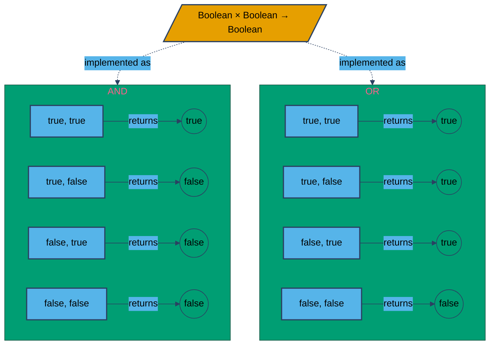
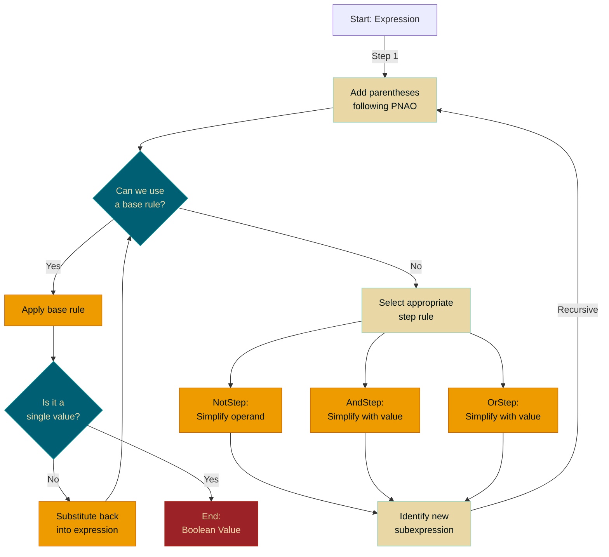

# Level 0.1: Booleans

In programming we must deal with many different types of data both for representing complex models, computing across equations, or even to provide an efficient user interface. However from a computer's perspective, this will often be broken down into simpler problems. And in this case we are here to discuss the simplest type we will be discussing in this course: *booleans*.
In this chapter we will:
1. *Define* booleans once again,
2. Formally describe the *behavior* of boolean operators,
3. Run through the process of *evaluating* boolean expressions,
4. Formally define and use *truth tables* to compute boolean expressions.

%% What if we introduce variables here in that we use variables, not in code but in solving these problems. We acknowledge in truth tables that when we talk about inputs to operators, we need some placeholder to define their behavior, this cleanly transitions into using variables... which we can formally define here or later, whichever makes more sense. %%

%% NOTE: we should introduce examples as:
Let's define x to be the boolean expression ..., 
x is complicated, and while we could try solving this in this form here, let's break it apart a bit instead.
we can break x down into two parts,
let's define y to be the left part...
and z to be the right part...
...
%%

---
## Defining Our Terms

Before we can start solving all of these boolean expressions, we need first define a boolean

>[!abstract] Booleans
>>[!Definition]
>> A *Boolean* represents the logical value *true* or *false*. 
>
> Often shown as 1/0 (on/off) or T/F in circuits and other systems. C# uses *true*/*false*.

In programming, we consider Booleans to be the cornerstone of decision making and code execution. Most things require us to make a decision. Our job as programmers will often boil down to taking abstract problems and representing them as a sequence of boolean expressions.

Any yes or no question is simply a boolean expression. When you search for something online, you are using words that the search engine will use to create a complex boolean expression to filter the results. In Level 2: Control Structures, we will cover how we use conditionals to cause different behaviors in our code as well. But first, let's worry about the operators that will let us build interesting boolean expressions.

>[!abstract] Boolean Operators
>>[!Definition] NOT
>> $NOT: Bool \rightarrow Bool$ is the logical negation operator. It flips *true* to *false*, and vice versa. Represented by `!` in C#.
>
>>[!Definition] AND
>> $AND: (Bool,Bool)\rightarrow Bool$ returns true when **both** operands are true. Otherwise it returns false. Represented by `&&` in C#.
>
>
>>[!Definition] OR
>>$OR: (Bool,Bool) \rightarrow Bool$ returns true when **either** operand is true. Otherwise, it returns false. Represented by `||` in C#.
>
> Notice that NOT takes only one operand, while the others take two. We often refer to single input operators as *unary* operators, while for two inputs we have *binary* operators.
>
> These three operators are all you need to represent any boolean problem. here's how it looks in code:
>> [!example] 
>> ```csharp
>>  !true // evaluates to false
>>  true && true // evaluates to true
>>  false || !false && true || false // evaluates to true
>> ```
>

You may notice in our definitions: both AND and OR share the same type signature! This may feel unintuitive, but it's important to note that a type signature exists to tell you and  the computer what kind of thing(s) go in, and what kind of thing comes out. They say nothing about how specific values are decided. That's why we describe *both* the typing of an operator, and separately, its behavior. To illustrate this, examine the figure below:



Notice in this figure, we cover every possible combination of inputs. This is standard when we define behavior in code: we want to cover all possible values to avoid errors or undefined behavior.

There's actually a formal notation for fully defining the behavior of different boolean expressions: the *Truth Table*. The goal of a truth table is: for every possible combination of inputs, what would the output be? Let's start with an example for NOT:


|   X   |  NOT X  |
| :---: | :-----: |
| true  | (blank) |
| false | (blank) |
Each column will represent a combination of values. The column(s) *after* our inputs will be filled in after, representing the output if we use the combination of inputs in the same row. Again: each row represents a combination of inputs, and the corresponding output received by using those inputs.

So after we've filled out the possible values for our input X, we can compute the output for each row:

|   X   |      NOT X       |
| :---: | :--------------: |
| true  | NOT true = false |
| false | NOT false = true |

Let's do this again but for one with multiple inputs: AND

| A     | B     | A AND B |
| ----- | ----- | ------- |
| false | false |         |
| false | true  |         |
| true  | false |         |
| true  | true  |         |
Remember, out input variables are fixed. We just fill out every possible combination in order. Once this is done, we can figure out what the outputs for each row (combination of inputs) are. Here it is broken down a little more:

| A     | B     | A AND B         |
| ----- | ----- | --------------- |
| false | false | false AND false |
| false | true  | false AND true  |
| true  | false | true AND false  |
| true  | true  | true AND true   |

Which then simplifies to:

| A     | B     | A AND B |
| ----- | ----- | ------- |
| false | false | false   |
| false | true  | false   |
| true  | false | false   |
| true  | true  | true    |

>[!important] Exercise
>Fill out the truth table for OR:
>
>| A     | B     | A OR B |
>| ----- | ----- | ------- |
>|___    |___    |___       |
>|   ___  |    ___  |  ___     |
>|   ___   |  ___   |  ___     |
>|   ___   |  ___    |    ___    |

---
## Evaluating Expressions

Now that we have precise definitions for how our operations work, let's cover one more important piece before we dive into solving problems: Order of Operations!

In traditional algebra, we have PEMDAS to denote ordering over the many operations. With our current expressions, we will have something a bit different:

 1. *Parenthesis*: Yes that's right, we use parenthesis to choose the order we apply things, just like regular algebra.
 2. *NOT*: We consider this our inverse operation, we look at this like multiplying by negative 1, (if I wrote -7 - 8, you intrinsically apply the negative to 7 before continuing, this is the same for NOT in boolean algebra).
 3. *AND*: To draw an allegory, AND is effectively boolean multiplication, and as such it will go before the others...
 4. *OR*: Similar to AND being multiplication, OR is the equivalent to addition with our logical values. Therefore it follows AND.

 This gives us: Parenthesis before *NOT*, before *AND*, before *OR*. Or **PNAO** (P*uh*-NOW) for short.

---
## Solving a Boolean Expression

Say I give you the boolean expression: 
```boolean_algebra
true AND (false OR (true AND NOT true)) OR true
```

You have two primary ways to think about solving it.


### Path 1: Priority-Based Simplification (PNAO)

**Repeat** until the expression is a single atomic value:

1. **Prioritize:** Identify the highest priority subexpression for simplification.
2. **Simplify:** Evaluate the subexpression using its truth table.
3. **Substitute:** Replace the subexpression with its atomic value.


---
#### Example

Say we begin with $$(true\ AND\ true)\ OR\ (true\ AND\ false)$$
First, we use PNAO to find the highest priority sub-expressions. Here there are two candidates:
$true\ AND\ true$, along with $true\ AND\ false$. We can do either first, it doesn't matter since they are separate expressions. Let's do $true\ AND\ true$ first.

Let's examine the AND truth table:

| A     | B     | A AND B |
| ----- | ----- | ------- |
| false | false | false   |
| false | true  | false   |
| true  | false | false   |
| true  | true  | true    |
Notice in our expression, we have to operands, $true$, and $true$. To solve using the truth table, we simply find the row where the first and second operand are $true$; this gives us the answer in the third column -> $true$.

Now once we substitute that in, we get the expression $$true\ OR\ (true\ AND\ false)$$
Let's simplify that right side next. Here, we look for the row where A equals $true$, and B equals $false$, collecting our answer from the third column once again. Here it is $false$. This yields $$true\ OR\ false$$
Now use the truth table for OR you made in the exercise above. (recall: the rule for OR: if *either* operand is true, the expression evaluates as true). You will find this evaluates to:
$$true$$
And we're done! Whenever we evaluate expressions, remember that we are done once we have reached a value, which we've defined to be data that we cannot simplify further.

---

Now that we've effectively given a form of evaluating boolean expressions similar to what you have already done before with math before, let's talk about a slightly different approach: How computers do this!
### Evaluating Expressions With Inference Rules

Writing a whole truth table each time you want to evaluate a boolean expression can become cumbersome quickly. Ideally with time, we can start to build an intuition for rules that come from them, so instead of computing every possible value, we can quickly simplify terms. This works great for us, however traditional computers don't have much in the way of intuition: so we provide these intuitions manually. In this section we'll discuss the rules we use, and how to solve these expressions in a way that matches the general process our compiler uses.

>[!abstract] Inference Rules 
>There are two main categories of inference rule: rules which simplify, and rules which bring us closer to simplifying. We indicate when it is the latter by calling it a "step" rule, as in stepping closer to simplifying. The rules for simplifying are simply called by the operations name. Another way you can tell: A rule for simplifying will output a value. A rule for stepping will give you a new simpler expression.
>
>>[!Definition] NOT Rules
>> $\frac{}{\texttt{not true} \longrightarrow \texttt{false}} \quad \text{(NotTrue)}$
>>$\frac{}{\texttt{not false} \longrightarrow \texttt{true}} \quad \text{(NotFalse)}$
>
>>[!Definition] AND Rules
>>$\frac{}{\texttt{true} \land \texttt{true} \longrightarrow \texttt{true}} \quad \text{(AndTrue)}$
>>$\frac{}{\texttt{false} \land e \longrightarrow \texttt{false}} \quad \text{(AndFalse)}$
>>$\frac{}{e \land \texttt{false} \longrightarrow \texttt{false}} \quad \text{(AndFalse)}$
>
>>[!Definition] OR Rules
>>$\frac{}{\texttt{true} \lor e \longrightarrow \texttt{true}} \quad \text{(OrTrue)}$ 
>>$\frac{}{e \lor \texttt{true} \longrightarrow \texttt{true}} \quad \text{(OrTrue)}$
>>$\frac{}{\texttt{false} \lor \texttt{false} \longrightarrow \texttt{false}} \quad \text{(OrFalse)}$
>
>Note, here $e$ is another expression which has not been simplified yet.
>
>>[!Definition] Step Rules
>>
>>| Rule Name      | Inference Rule                                             |
>>|-----------------|-----------------------------------------------------------|
>>| AndStepLeft    | $\frac{e_1 \longrightarrow e_1'}{e_1 \land e_2 \longrightarrow e_1' \land e_2}$ |
>>| AndStepRight   | $\frac{v_1 \text{ is a value} \quad e_2 \longrightarrow e_2'}{v_1 \land e_2 \longrightarrow v_1 \land e_2'}$ |
>>| OrStepLeft     | $\frac{e_1 \longrightarrow e_1'}{e_1 \lor e_2 \longrightarrow e_1' \lor e_2}$ |
>>| OrStepRight    | $\frac{v_1 \text{ is a value} \quad e_2 \longrightarrow e_2'}{v_1 \lor e_2 \longrightarrow v_1 \lor e_2'}$ |
>>| NotStep        | $\frac{e \longrightarrow e'}{\texttt{not } e \longrightarrow \texttt{not } e'}$ |
>
> To use a step rule is to say: the full expression does not have a rule which simplifies it, however I can choose a step rule which matches to bring it closer.

Now that is a lot of rules! However, before worrying too much: notice that each of these rules correspond to something we've done already. Step rules represent how we use PNAO to find the first expression we can simplify, while the remaining rules each correlate to a row in our truth table. Don't believe me? Well let's take AndFalse for example:

>[!example] ANDFalse and Truth Tables
>First, let's look at both the table, and the rule:
>
>| A     | B     | A AND B |
>| ----- | ----- | ------- |
>| false | false | false   |
>| false | true  | false   |
>| true  | false | false   |
>| true  | true  | true    |
>
> $\frac{}{\texttt{false} \land e \longrightarrow \texttt{false}} \quad \text{(AndFalse)}$
>$\frac{}{e \land \texttt{false} \longrightarrow \texttt{false}} \quad \text{(AndFalse)}$
>
 Notice how we have two ANDFalse rules. This is intentional. We must cover the case where the left side is false and the right is *any* expression, and the case where the right side is false and the left an expression.
>
>- Well, now if we look in our truth table, the first rule is the equivalent of our second row, with the first operand being false, and the other being some expression.
>- Similarly, our second ANDFalse rule covers the third row.
>- And in case you were wondering: which covers the first? Well both can. Since an expression can consist of a value, either will take the (false,false) case.

The same is true for each of our simplification rules, which I leave you to check as an exercise.

Let's break down the process we're about to follow to apply these and solve expressions:

1. **Parenthesize (PNAO):** Add parentheses to the expression, following the order of operations (PNAO: Parentheses,Not, And, Or), until the entire expression is clearly grouped into two main subexpressions joined by a single operator.
    
2. **Simplify the Outermost Operation:**
    - **Base Rule?**: Can a base rule (e.g., `AndTrue`, `OrFalse`, `NotTrue`) be applied to simplify the _outermost_operation and its operands to a single value (`true` or `false`)?
        - Yes: Apply the rule. Go to step 4.
        - No: Go to step 3.

3. **Apply a Step Rule:**
    - If the outermost operation is `not`, and its operand can be simplified further, apply the `NotStep` rule.
    - If the outermost operation is `and` or `or`, and one of its operands is a value while the other can be simplified,apply the appropriate `AndStep` or `OrStep` rule (left or right) to the full expression.
    - Using the chosen step rule, identify the new subexpression that needs simplification.
    - Go back to step 1, applying these steps recursively to the new subexpression.
      
4. **Substitute and Repeat:** After applying a rule in step 2, substitute the simplified value back into the larger expression. Then, return to step 2 and repeat the process until the entire expression is reduced to a single Boolean value (`true` or `false`



Let's walk through an example or two to be sure we got it.

---

Take the expression $true\ and\ (false\ or\ not\ false)$

First, we can see that it is properly parenthesized -> it is an expression consisting of an operator with an appropriate number of input expressions.

Second, we look through our AND rules to see which fit this shape: AndStepRight.
Which is $\frac{v_1 \text{ is a value} \quad e_2 \longrightarrow e_2'}{v_1 \land e_2 \longrightarrow v_1 \land e_2'}$
This means we can break this down into 
$true$ and (the result of solving the subexpression)

Where our subexpression is 
$false\ or\ not\ false$.

Now we go to step 1 to see if we can parenthesize this, which we can:
$false\ or\ (not\ false)$

We need to check our step rules again, and we see that we are looking at: OrStepRight
$\frac{v_1 \text{ is a value} \quad e_2 \longrightarrow e_2'}{v_1 \lor e_2 \longrightarrow v_1 \lor e_2'}$

Here what we simplify this to is 
$false\ or$ (whatever this expression simplifies too)

We can now take this expression, notice it does not need parenthesizing:
$not false$
Further, it is an operator with all its operands! This means we can finally simplify a value!
We can use the aptly named NotFalse rule as described:
$\frac{}{\texttt{not false} \longrightarrow \texttt{true}} \quad \text{(NotFalse)}$
This gives us $true$!

Now we simply go back up, simplifying along the way:
$false\ or\ true$
this again is an expression which can be solved with one of our rules: OrTrue!
$\frac{}{e \lor \texttt{true} \longrightarrow \texttt{true}} \quad \text{(OrTrue)}$
Which gives us:
$true$!

Now we can go a step further up, giving us
$true\ and\ true$
Which for the astute, sure looks like an AndTrue to me. Using this rule, we get $true$ for our final answer.

---

This process may feel harder to follow, in class and lab we will go over examples which show you a more intuitive way to follow this process. In the mean time: notice how with this current form, we always check to see if we can simplify it before we step! We don't always do this with PNAO. As you will see in our next example, this can save us some valuable time.

>[!Notation] NOTATION 🚧
>AND has several notations you will see throughout your degree. AND is what we've used so far, but here is a short list of what you may encounter:
>- AND: Used when speaking or for phonetic needs.
>- `&&`: Used in C# and some other programming languages.
>- $\land$: Used in mathematics.
>We will be using a combination of these, so be ready to match with them else where. Similarly for OR:
>- OR,
>- `||` as in `true || false`
>- $\lor$ as in $true \lor false$
>And finally for NOT:
>- NOT
>- `!` as in  `! true`
>- $\lnot$ as in $\lnot true$


---
## Harder Examples

Now that we've run through some simpler expressions, let's take a crack at one which is more complicated. First we will use PNAO, then after we will use the break and bubble technique:
### PNAO!

using the **Priority-Based Simplification (PNAO)** approach:

1. **P**arentheses
2. **N**OT
3. **A**ND
4. **O**R

We repeat identifying and simplifying the highest-priority subexpression until the entire expression is a single truth value.

---

**Expression to Simplify**

$$ \text{true AND (false OR (true AND NOT true)) OR true} $$

---

**1. Identify the Highest Priority Subexpression (P → N → A → O)**

- **Parentheses** have priority, so inside the big parentheses $(\dots)$, we see a smaller one: $(true AND NOT true)$.
- Within $(true AND NOT true)$, there is a **NOT**, which is our next highest priority to evaluate.

So the very first subexpression we focus on is $\text{NOT true}$ inside $(true AND NOT true)$.

---

**2. Simplify the Innermost Subexpression**

**2.1 Evaluate $\text{NOT true}$**

From the **NOT** truth table:

|A|NOT A|
|:--|:--|
|false|true|
|true|false|

Here, $A = \text{true}$. Therefore,

$$ \text{NOT true} \quad=\quad \text{false}. $$

---

**2.2 Substitute Back**

Now we replace $\text{NOT true}$ with `false` in the subexpression $(true AND NOT true)$:

$$ (true \ \text{AND}\ \text{false}). $$

---

**3. Next Priority: AND**

According to PNAO, once we handle all NOTs inside parentheses, we move on to **AND**.

**3.1 Evaluate $(true AND false)$**

Using the **AND** truth table:

|A|B|A AND B|
|:--|:--|:--|
|false|false|false|
|false|true|false|
|true|false|false|
|true|true|true|

For `true AND false`, the result is `false`. So

$$ (true \ \text{AND}\ \text{false}) \quad=\quad \text{false}. $$

---

**3.2 Substitute Back**

We replace $(true AND NOT true)$ with `false` in the original expression:

$$ \text{true AND (false OR false) OR true}. $$

So now our expression is:

$$ \text{true AND (false OR false) OR true}. $$

---

**4. Next Priority: Parentheses (Again) Then OR**

We still have parentheses left: $(false OR false)$. We now evaluate that **OR**.

**4.1 Evaluate $(false OR false)$**

From the **OR** truth table:

|A|B|A OR B|
|:--|:--|:--|
|false|false|false|
|false|true|true|
|true|false|true|
|true|true|true|

For `false OR false`, the result is `false`.

$$ (false \ \text{OR}\ \text{false}) \quad=\quad \text{false}. $$

---

**4.2 Substitute Back**

Now we substitute that in:

$$ \text{true AND false OR true}. $$

At this point, all parentheses are gone. By PNAO, we do any remaining **AND** operations next, then **OR**.

---

**5. Evaluate the AND Next**

**5.1 Evaluate $(true AND false)$**

We use the AND table again:

$$ \text{true AND false} \quad=\quad \text{false}. $$

So the expression becomes:

$$ \text{false OR true}. $$

---

**6. Finish with OR**

**6.1 Evaluate $(false OR true)$**

From the OR table:

$$ \text{false OR true} \quad=\quad \text{true}. $$

---

**Final Result**

The expression simplifies to:

$$ \text{true}. $$

Hence,

Code snippet

```
true AND (false OR (true AND NOT true)) OR true = true
```

### Inference Rules!

Again, we start with $$true\ AND\ (false\ OR\ (true\ AND\ NOT\ true)) OR\ true$$
Remember that our first step is going to be: parenthesize!
This yields $$(true\ AND\ (false\ OR\ (true\ AND\ NOT\ true)) )OR\ true$$
We can scan our rules and see we have one just for this: ORTrue!

Remember: $\frac{}{e \lor \texttt{true} \longrightarrow \texttt{true}} \quad \text{(OrTrue)}$

Applying this rule yields: $true$. 

## Conclusion

Notice that, while both methods can be difficult and require many steps, learning the rules will sometimes present us with shortcuts such as this one, formally described below.

> [!seealso] SHORTCUT
> Notice how in the beginning, our terms, A `or` B was really A `or true`. If we look at the `OR` truth table we see that any time that `true` is present as an input to `OR`, it simplifies to `true`. By practicing and becoming familiar with how these operators work, you too can find shortcuts to solving these problems.
> 
> This is commonly referred to as *short-circuit evaluation*, which C# will do with Boolean expressions when it can.
> 

Now that our primer on boolean expressions is wrapped up, be sure to do the practice problems *by hand*. Learning happens with practice, which unfortunately can't be short-circuit evaluated.

In our next section we'll talk about a more familiar type system: NUMBERS